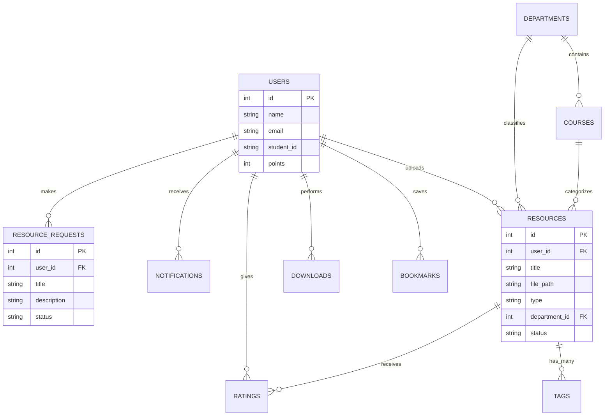
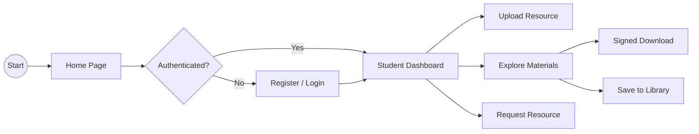
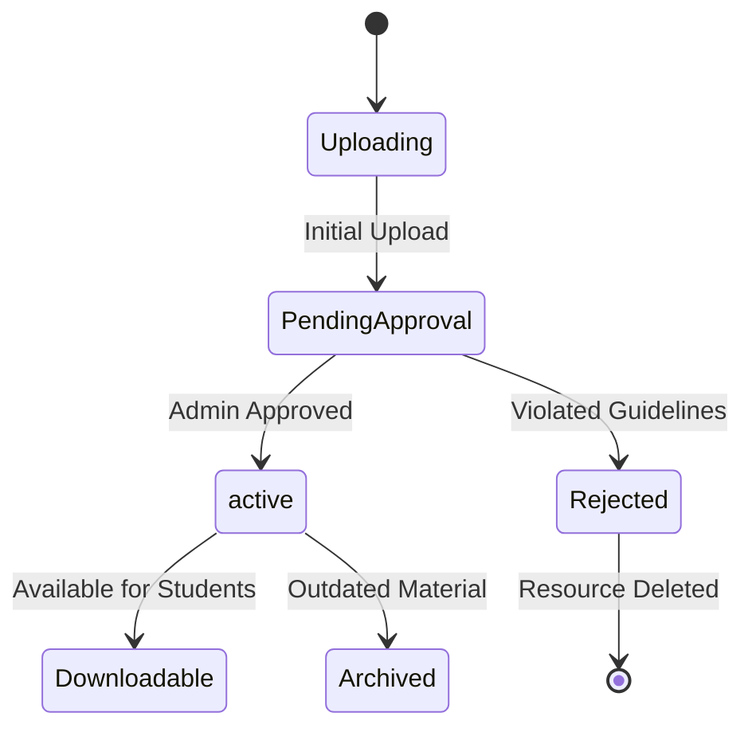
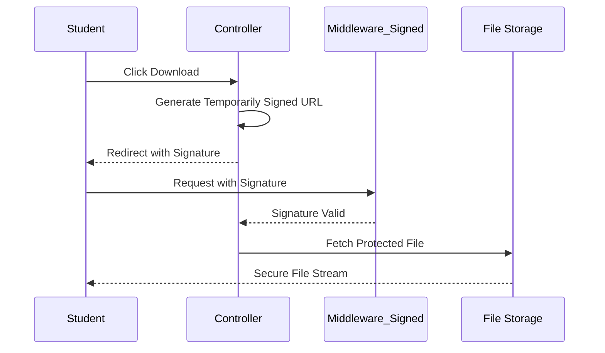

#  DIU-Hub - Academic Resource Sharing Platform

<div align="center">

[](https://visitorbadge.io/status?path=TheSourav-001%2FDIU-Hub)
[](https://www.php.net/)
[](https://laravel.com/)
[](https://www.mysql.com/)
[](https://opensource.org/licenses/MIT)


</div>

---

## 🌟 Overview

**DIU-Hub** is a state-of-the-art, feature-rich academic platform designed for the **Daffodil International University (DIU)** community. It bridges the gap between students and peer-shared learning materials, using a centralized repository for lecture notes, question banks, and course resources.


### 🔴 The Problem
Students often struggle to find organized, course-specific study materials, relying on scattered social media groups or outdated physical copies which are difficult to search through.

### 🟢 The Solution (DIU-Hub)
A centralized, secure, and real-time portal that organizes academic reports, verifies content through admin moderation, and rewards contributors through a premium-grade user experience.

---

## 🚀 Key Features

| | Feature | Description |
|---|---|---|
| 📦 | **Resource Management** | Advanced uploading with drag-and-drop support, categories, and real-time scannability. |
| 🔍 | **Smart Search** | Powerful filtering by Course Code, Department, and Faculty with instant results. |
| 🏆 | **Leaderboard** | "Top Contributors" tracking that rewards active sharers with community recognition. |
| 🛡️ | **Enterprise Security** | Built on Laravel 11 with signed download URLs, CSRF protection, and Rate Limiting. |
| 🔔 | **Smart Alerts** | Real-time notifications for system updates, approvals, and resource requests. |
| 🔖 | **Bookmarks** | Save your most-needed study materials to your personal dashboard for quick access. |

---

## 🖼️ System Preview

<div align="center">

| Dashboard Insights | Mobile Experience |
| --- | --- |
|  |  |

</div>

---

## 🏗️ Architecture

DIU-Hub follows a robust **Model-View-Controller (MVC)** architectural pattern using the **TALL Stack** for a reactive and scalable experience.

```mermaid
flowchart TD
    A[Student Browser] -->|HTTP Request| B[Vite / Web Server]
    B -->|Route Handling| C[Laravel 11 Controller]

C -->|Fetch / Save Data| D[Eloquent Model]
D -->|SQL Queries| E[(MySQL Database)]

C -->|Render Dynamic UI| F[Blade Views + Alpine.js]
F -->|Responsive HTML| A

subgraph Security Layer
G[Signed URLs / Download Guard]
H[CSRF Protection]
I[Rate Limiter]
J[Secure Session (Breeze)]
end

C -. Security Checks .-> G
C -. Security Checks .-> H
C -. Security Checks .-> I
C -. Security Checks .-> J
```

---

## 📊 Visual Documentation

### 🗄️ Database ER Diagram


### 🛣️ User Flow


### 🔁 Resource Approval Process


### 🔐 Secure Download Flow


---

## 🛡️ Security Hardening

- **CSRF Protection**: Native Laravel tokens for all state-changing interactions.
- **Signed URLs**: Downloads are protected with time-limited signed signatures to prevent direct linking.
- **Rate Limiting**: Integrated anti-spam mechanisms for uploads and requests (Throttle middleware).
- **Secure Sessions**: HTTP-Only and SameSite cookie policies via Laravel Session layer.
- **XSS Prevention**: Automated Blade output encoding.
- **SQLi Protection**: Full abstraction via Eloquent ORM and Query Builder.

---

## 🛠️ Installation Guide

### Prerequisites
- PHP 8.2+
- MySQL 8.0+
- Composer & NPM

### Setup Steps
1. **Clone the repository**:
   ```bash
   git clone https://github.com/TheSourav-001/DIU-Hub.git
   ```
2. **Install Dependencies**:
   ```bash
   composer install
   npm install
   ```
3. **Environment Setup**:
   - Copy `.env.example` to `.env`.
   - Configure your `DB_DATABASE`, `DB_USERNAME`, and `DB_PASSWORD`.
   ```bash
   php artisan key:generate
   ```
4. **Database Migration**:
   ```bash
   php artisan migrate --seed
   ```
5. **Compile Assets & Launch**:
   ```bash
   npm run dev
   # Open another terminal
   php artisan serve
   ```

---

## 👨‍💻 Developed By

**Sourav Dipto Apu**  
*Full-Stack Developer & UI/UX Enthusiast*

[](https://linkedin.com/in/thesourav)
[](https://github.com/TheSourav-001)

---
<div align="center">
  <sub>Built with ❤️ for the DIU Community</sub>
</div>
